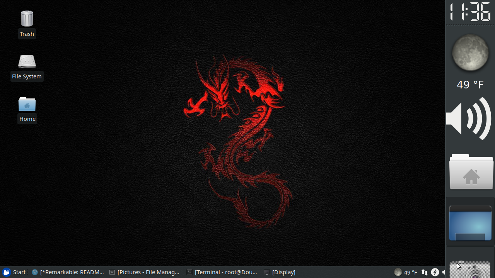

#Red Dragon Xubuntu Base Scripts#
These scripts alter the Xubuntu operating system as described:

##xfce4_appearance.sh##
This script replaces the plymouth boot screen background, the default wallpaper, and the XFCE settings so that the default desktop appears like so:

The side panel contains the time, the weather (currently set to Murfreesboro, TN), a widget to control the PulseAudio volume settings, a widget to open common user folders easily without using Thunar, a widget to minimize all windows, and a screenshot widget (which is what I used to create the above screenshot).

The bottom panel contains the weather (again), the network tray icon, the power management tray icon, the volume controls (again), and the time.

**KNOWN ISSUE**: The side panel sometimes overlaps the bottom panel, as shown in the screenshot above.  It don't know how to fix it properly.  Howver, it doesn't bother me since I can see the time much more clearly in the upper right corner of my desktop.  This can be manually fixed by clicking on the bottom panel.....

**WALLPAPER SOURCE**: [1920x1080 wallpaper from WallpaperCave.com](https://wallpapercave.com/w/aAMbyIM), resized to 1280x720 by me because it didn't show up on the bootscreen without doing so....

##dev_workspace.sh##
This script adds a finisher script that performs the following tasks:

- Creates some directories: **/home/img**, **/home/img/edit**, **/home/img/extract**, and **/home/img/mnt**.
- Modifies **/etc/fstab** in order to mount **/home/img/edit** and **/tmp** into a RAM drive.
- Links **/home/img** to **/img** for convenience.

##extra_packages.sh##
This script installs these packages on the OS:

- **dh-modaliases**
- **build-essential**
- **linux-headers-generic**
- **dkms**
- **dpkg-dev**
- **debhelper**
- **checkinstall**
- **ttf-ubuntu-font-family**
- **net-tools**
- **rename**

##fix_no_ethernet.sh##
This script installs a script to restart the network components after a suspend/hibernation of the system.  This script encompasses the solution about my network failing to come back up after suspend and it has worked since....

##fix_usb_wakeup.sh##
This script creates the **/etc/rc.local** file if it does not exist, and makes it executable.  This script adds a finisher script that stops USB devices from waking up the system when in suspend (and maybe hibernation, too).  My cats keep turning on my system when I'm asleep by walking across the keyboard (or something)....

##imitation_dos_cmds.sh##
This script adds the following aliases:

- **/bin/cp** aliased to **/usr/local/bin/copy**
- **/bin/mv** aliased to **/usr/local/bin/move**
- **/bin/mv** aliased to **/usr/local/bin/ren**
- **/bin/mkdir** aliased to **/usr/local/bin/md**
- **/bin/rmdir** aliased to **/usr/local/bin/rd**
- **/bin/rm** aliased to **/usr/local/bin/del**
- **/bin/cat** aliased to **/usr/local/bin/list**
- **/bin/nano** aliased to **/usr/local/bin/edit**
- **/sbin/ifconfig** aliased to **/usr/local/bin/ipconfig**
- **/usr/bin/clear** aliased to **/usr/local/bin/cls**

##spybot_hosts.sh##
This script adds a finisher script that extracts an extenstion to the **/etc/hosts** file in order to protect the computer from malware and spyware.  Note the list was generated on a Windows system by SpyBot Search and Destroy (which doesn't run on Xubuntu)....

##timeshift.sh##
This script installs [TimeShift](https://teejeetech.in/2019/08/11/timeshift-v19-08/) onto your computer.  

This script also adds a finisher script that creates the **/etc/timeshift.json** file for you, but only when the root partition is a BTRFS partition.  It is hoped that this will trigger the initial snapshot by TimeShift immediately after installation on systems with a BTRFS root partition....

##truecrypt.sh##
This script installs [TrueCrypt](https://launchpad.net/~stefansundin/+archive/ubuntu/truecrypt) onto your compuer.  It also modifies the autostart launcher to not start TrueCrypt when **xfce4-session** is not running, in order to keep it from popping up over Kodi when it is running.

##xfce4_alt_repos.sh##
When I started on my Xubuntu HTPC build, I had a hard time updating using the default sources list.  So I changed the services that Xubuntu uses by default and haven't had a problem updating or installing packages on my system since.  So this script installs the new sources list on your OS....

##xfce4_restricted_extras.sh##
This script installs **ubuntu-restricted-extras**, which supports for MP3 and unencrypted DVD playback, Microsoft TrueType core fonts, the Flash plugin, and codecs for common audio and video files.

This script also installs and builds **libdvd-pkg** and **libdvdcss2**, then marks the resulting package on hold to prevent it from being updated.

##xfce4_settings.sh##
This script makes several settings changes to Xubuntu:

- Disable notifying about new LTS upgrades...
- Setup automatic removal of new unused dependencies...
- Keep the annoying **System Program Problem Detected** dialog from popping up...
- Change default timeout in GRUB to 1 second...
